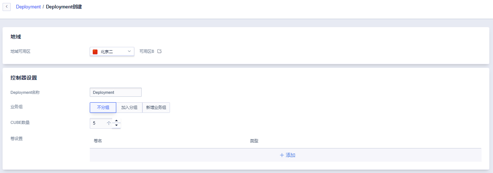
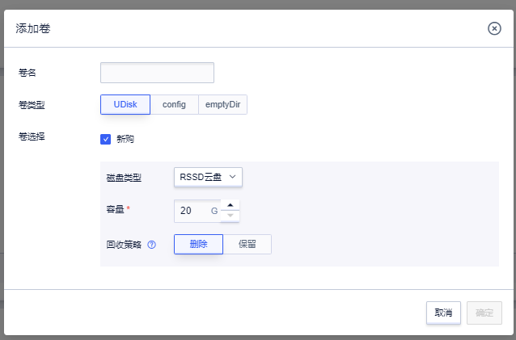
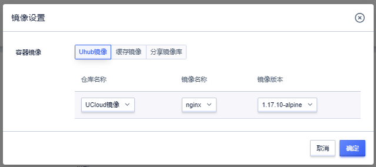
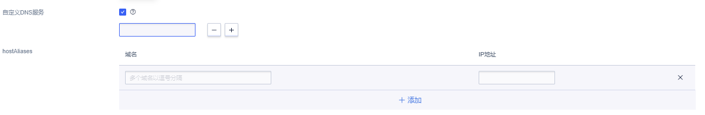

# 批量创建 Cube 实例

Cube Deployment 功能与原生 K8S 中的 Deployment 类似，实现了对 Cube 实例的批量创建、修改、删除，进一步降低了容器实例的管理和运维成本。

## 快速通过 Deployment 批量创建 Cube 实例

##### 1. 基础配置  

点击 Deployment 页面「创建容器组」，进入 Deployment 创建页面，选择所需的可用区，输入自定义 Deployment 名称，并选择当前 Deployment 中所需的 Cube 实例的数量（同一个 Deployment 中最多可以包括 50 个 Cube 实例）及所需加入的业务组。

##### 2. 卷设置  

非必选。在卷设置中点击「添加」，为 Deployment 中的 Cube 实例配置相应的存储卷。

Deployment 目前支持挂载 *UDisk 云盘*、*config 类型*（类比 Kubernetes 中的 configMap 资源对象，参见[在 Cube 中使用 Config](/cube/volume/config.md)）及 *emptyDir 类型*。

Deployment 提供多种 UDisk 类型支持，包括 RSSD 云盘、SSD 云盘及普通 SATA 云盘 UDisk 硬盘后，仍需通过容器高阶设置中的「挂载卷」对云盘进行挂载，挂载方法参见[在 Cube 中使用 UDisk](/cube/volume/config.md#挂载卷)。

##### 3. 容器设置  

选择 Cube 实例后端平台（Intel/AMD，实际可选平台视可用区略有不同），并为 Cube 实例中的每一个 container 容器配置相应的 CPU / 内存资源及容器镜像，一个 Cube 实例中最多支持 3 个容器。

容器镜像支持 *[UHub 镜像](/uhub/README.md)*（支持同一项目下镜像仓库，及 UCloud 公开仓库）、*缓存镜像*、*共享镜像*（仅支持Uhub镜像仓库公开分享镜像），对同一账号下 VPC 内自建镜像仓库的支持也即将上线。

高阶设置包括*工作目录（workDir）*、*命令（command）*、*参数（args）*、*环境变量*的配置，及存储卷的挂载，详见[Cube 创建详解](/cube/userguide/describe_create.md#高阶设置)。

##### 4. 重启策略

为 Deployment 中的 Cube 实例配置[重启策略](/cube/question/restart_policy.md)，分别为总是(Always)、失败时(OnFailure)、从不(Never)。

##### 5. 自定义 DNS 服务及 HostAliases

为 Deployment 中的 Cube 实例添加自定义 DNS 服务，如无需自定义，则默认使用 UCloud 内网 DNS 地址；当 DNS 配置不合理的时候，可以通过通过 HostAliases 字段向 Cube 实例的 /etc/hosts 文件中添加条目， 覆盖对主机名的解析。 

##### 6. 自定义网络

* 同一 Deployment 中的 Cube 实例将位于同一个 VPC 子网，请合理配置子网大小。
* 根据程序需要选择是否绑定外网弹性 IP 和选择对应的防火墙设置。