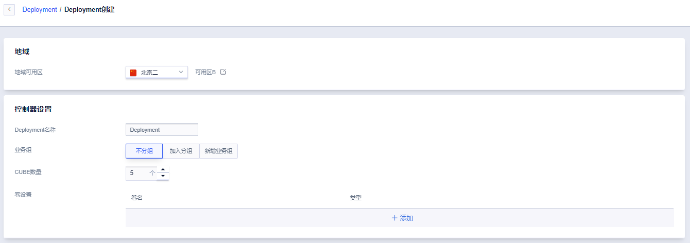
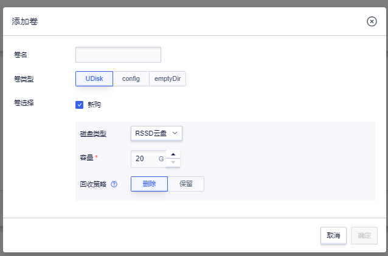

# 批量创建 Cube 实例

Cube Deployment 功能与原生 K8S 中的 Deployment 类似，实现了对 Cube 实例的批量创建、修改、删除，进一步降低了容器实例的管理和运维成本。

## 快速通过 Deployment 批量创建 Cube 实例

1. **基础配置**  点击 Deployment 页面「创建容器组」，进入 Deployment 创建页面，选择所需的可用区，输入自定义 Deployment 名称，并选择当前 Deployment 中所需的 Cube 实例的数量（同一个 Deployment 中最多可以包括 50 个 Cube 实例）及所需加入的业务组。

2. **卷设置**  非必选。在卷设置中点击「添加」，为 Deployment 中的 Cube 实例配置相应的存储卷。

Deployment 目前支持挂载 *UDisk 云盘*、*config 类型*（类比 Kubernetes 中的 configMap 资源对象，参见[在 Cube 中使用 Config](/cube/volume/config.md)）及 *emptyDir 类型*。

Deployment 提供多种 UDisk 类型支持，包括 RSSD 云盘、SSD 云盘及普通 SATA 云盘 UDisk 硬盘后，仍需通过容器高阶设置中的「挂载卷」对云盘进行挂载，挂载方法参见[在 Cube 中使用 UDisk](/cube/volume/config.md#挂载卷)。

