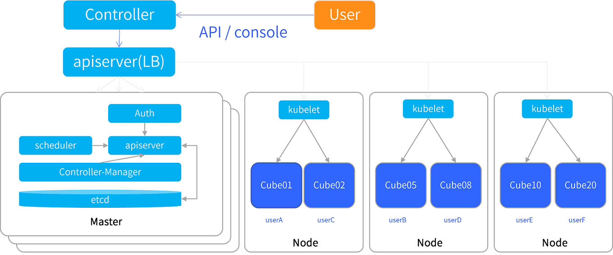

# 什么是 Cube

Cube 产品取名于 Kube 谐音，且有立方体的含义。如果您有使用过 Kubernetes，可以把 Cube 的一个实例理解为 Kubernetes 中的最小业务单元 Pod。一个 Cube 实例中包含一组（一个或多个） 容器（Container），这些容器共享存储、网络、以及怎样运行这些容器的声明。

Cube 的出现使您不需要再去关心底层的云主机或者 Kubernetes 控制，您可以随心所欲的将您的程序镜像放进这个立方体（Cube）中运行。

Cube 产品采用 Serverless 架构，底层为海量 UCloud 基础设施资源，无需等待虚拟机启动，无需等待 Kubernetes 集群启动，您可以秒级拉起您的业务容器提供服务。

Cube 产品基于社区开源的 Firecracker 作为虚拟化和容器化的支撑管理，同时我们针对容器化的业务运行进行了深度优化，使 Cube 实例具备了虚拟机级别的安全隔离、轻量化的系统占用、秒级的启动速度。

<!--缺图-->
