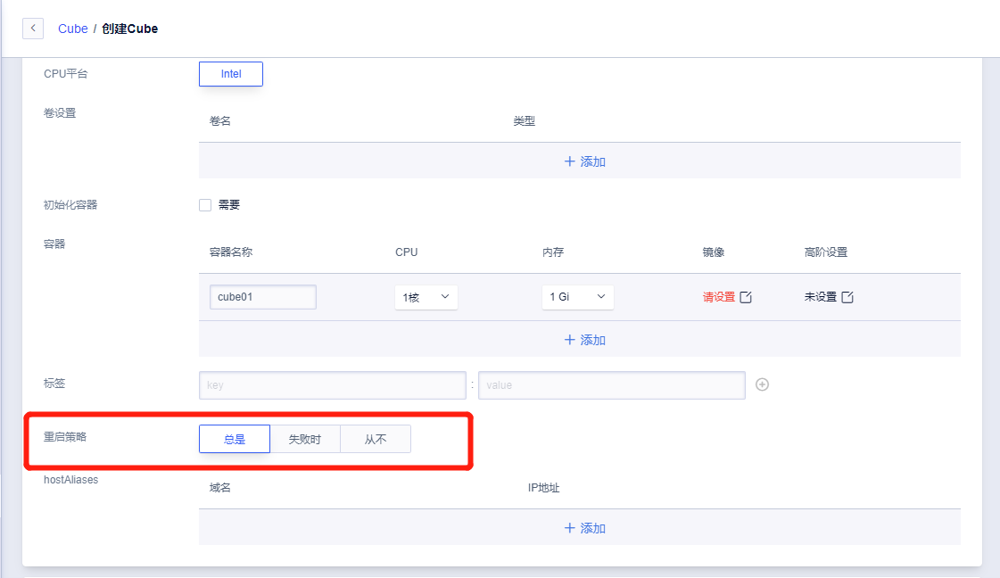

# 容器重启策略

## 重启策略说明

我们在创建容器组时，这里可以设置我们创建的Cube实例的重启策略，分别为`总是(Always)`、`失败时(OnFailure)`、`从不(Never)`，默认为`总是(Always)`。

|重启策略|含义|
|---|---|
|总是(Always)|不管容器中程序的类型，当容器处于非running状态时即会发生重启|
|失败时(OnFailure)|只考虑容器运行故障（OOM、程序问题等）进行重启，当容器执行至完成状态(Completed)时将不会发生重启|
|从不(Never)|不管容器运行至什么状态，均不会发生重启|

## 重启延时规则

当您的容器运行故障发生重启时（OOM、程序问题等）会触发重启延时规则。当您的容器不停的启动失败，第一次是立即重启，第二次是10s，第三次是20s，第四次是40s，一次类推，最长延时为5分钟（300s）。

当您的容器运行正常10分钟后且期间没有出现问题，重启延时规则将会被重置归零。