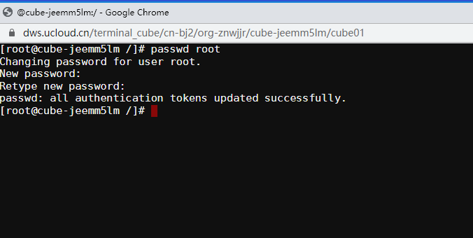

# 使用Cube创建带SSH服务的CentOS容器

>考虑容器运行无法持久化存储数据，不建议将Cube容器作为云主机使用，如需存储数据可在Cube容器实例创建时挂载云盘到指定数据存储路径。

创建Cube时选择容器镜像为Cube_Lab仓库下的centos-ssh镜像，版本目前支持7.8.2003。

选择绑定外网弹性IP，确认并进行创建。

## 修改密码

镜像没有默认初始密码，需要用户待容器运行状态变为`running`以后，在Cube容器组详情页面点击`登录`。

登录容器后输入`passwd root`输入新的密码。

## 测试ssh登录

接下来用我们使用我们创建时的EIP尝试ssh登录操作，如下图。

