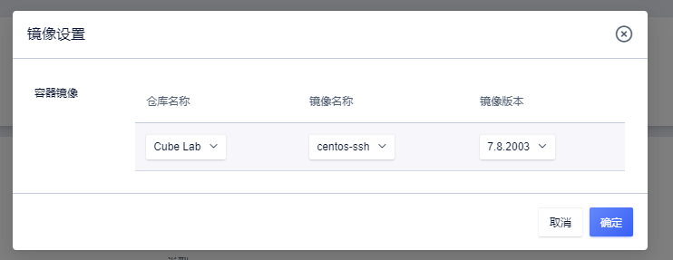
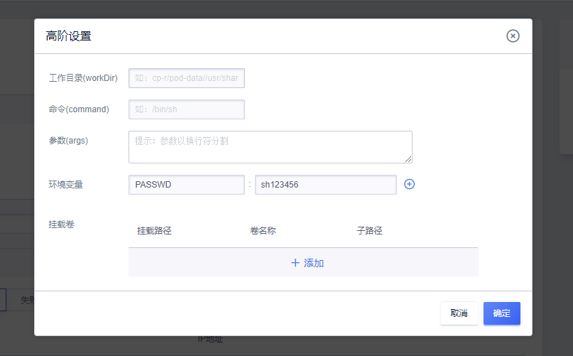
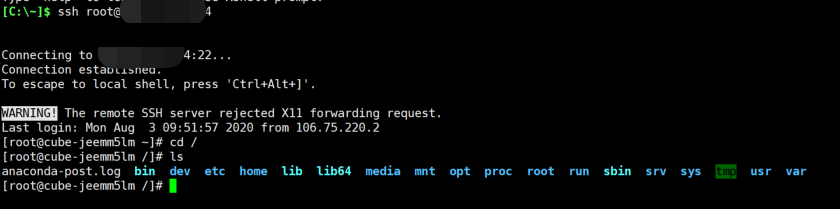

# 使用Cube创建带SSH服务的CentOS容器

>考虑容器运行无法持久化存储数据，不建议将Cube容器作为云主机使用，如需存储数据可在Cube容器实例创建时挂载云盘到指定数据存储路径。

## 选择镜像

创建Cube时选择容器镜像为Cube_Lab仓库下的centos-ssh镜像，版本目前支持7.8.2003。

## 设置密码

点击打开容器高阶设置，在环境变量输入`PASSWD`:`youpassword`设置您的密码。

选择绑定外网弹性IP，确认并进行创建。

## 测试ssh登录

接下来用我们使用我们创建时的EIP尝试ssh登录操作，如下图。

