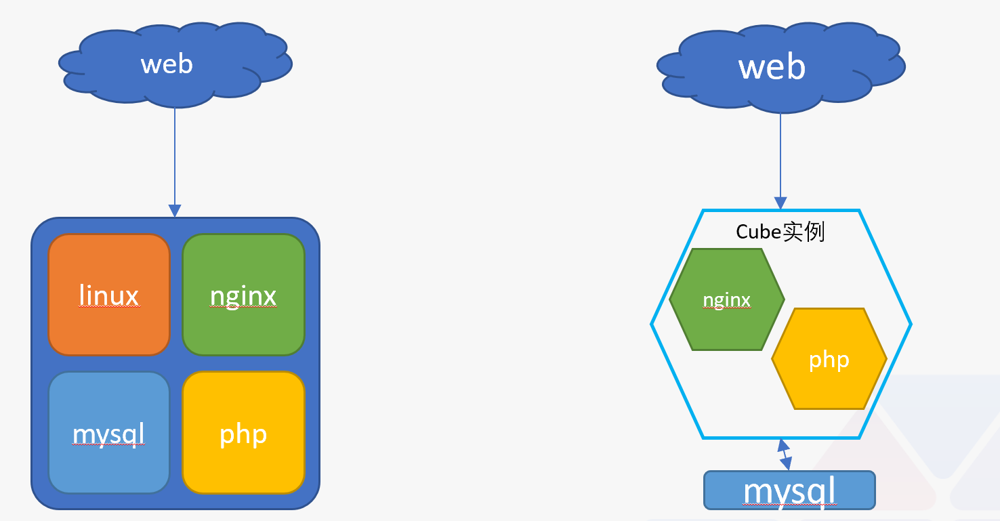
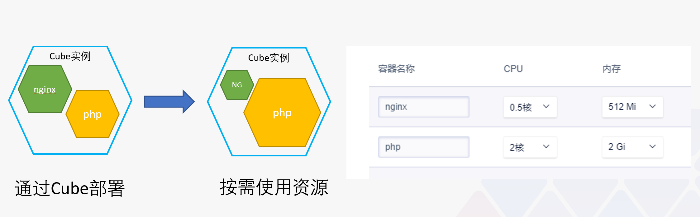
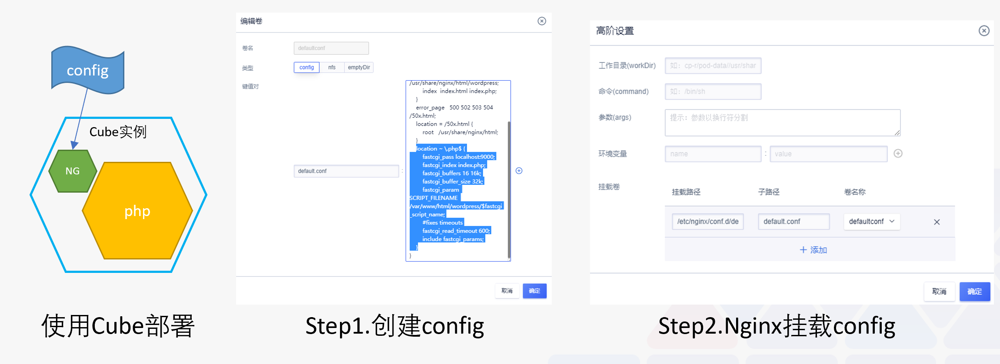
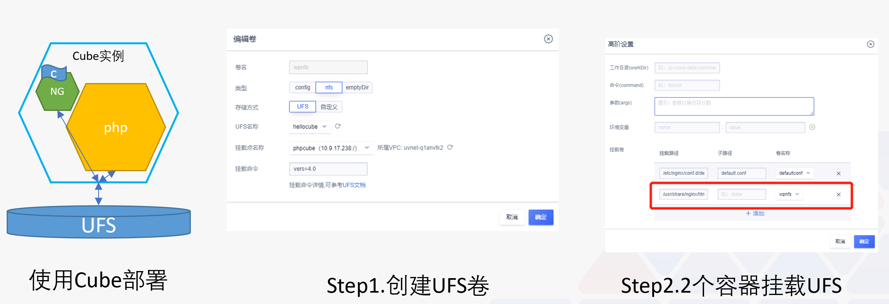
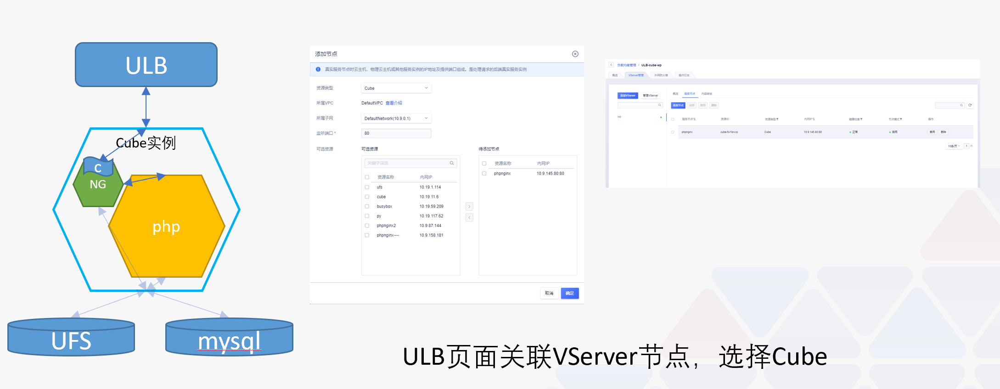
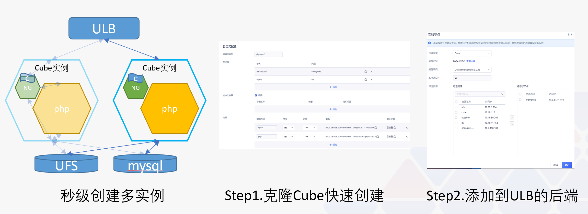

# PHP应用的高可用部署

今天我们将一起通过一个实践将一个PHP网站运行在Cube上！

## 原LNMP环境改造

LNMP环境是我们非常常见的PHP网站运行的环境，我们将其中的功能进行区分，NGINX负责转发、PHP负责程序运行，原PHP程序运行时基本是运行在这两个程序的共同目录下，NGINX负责将用户请求的具体网址进行后缀筛选转发给PHP运行接口处理。

由于容器推荐是单进程的，所以在Cube中我们将NGINX和PHP拆成了2个容器，Cube有容器组的概念，所以我们将2个容器放到了一个组里。



## 弹性使用

这里我们选择添加2个容器，分别是NGINX和PHP，NGINX镜像我们选择官方镜像即可，PHP镜像我们最好选择是具体PHP程序的镜像或者基于PHP-FPM的基础镜像安装程序依赖的PHP组件。

我们可以根据应用设定具体使用资源值，由于NGINX转发动作可能资源使用很小，参照K8S的Pod（容器组）资源对象，在这里Cube容器组内的容器是可以进行资源共享使用，如果PHP资源不够的话会占用一部分NGINX容器的资源，达到容器组的资源最大化使用。



## 配置分离

前面说到我们将2个容器放进了1个容器组，参照K8S的Pod(容器组)资源对象，容器组内容器之间是可以本地调用的，所以在我们原来的LNMP环境下NGINX的配置是可以直接在容器中使用的，这里我们用配置卷挂载而不是构建在镜像中，方便我们维护这个配置。

我们在卷设置中添加config类型的卷，并填入NGINX配置`default.conf`

在NGINX容器的高阶设置中添加挂载路径`/etc/nginx/conf.d/default.conf`和子路径`default.conf`，选择之前我们创建好的卷，然后保存，这里子路径的设置是为了我们在该挂载路径下只覆盖具体的default.conf文件，而不会将整个文件夹下覆盖。



### 这里说两个需要注意的点：

1. Cube实例是一个容器组，所以NGINX配置几乎不用修改，依然本地访问PHP
2. 配置等卷设置，都需要在容器的高阶设置中挂载后才会生效

### 附一个NGINX的配置卷例子

```config
server {
    listen       80;
    server_name  localhost;

    location / {
        root   /usr/share/nginx/html/wordpress;
        index  index.html index.php;
    }
    error_page   500 502 503 504  /50x.html;
    location = /50x.html {
        root   /usr/share/nginx/html;
    }
    location ~ \.php$ {
        fastcgi_pass localhost:9000;
        fastcgi_index index.php;
        fastcgi_buffers 16 16k;
        fastcgi_buffer_size 32k;
        fastcgi_param SCRIPT_FILENAME /var/www/html/wordpress/$fastcgi_script_name;
        #fixes timeouts
        fastcgi_read_timeout 600;
        include fastcgi_params;
    }
}
```

## 存储分离

容器是无状态的将不会保存任何数据，所以我们这里将我们的PHP程序放在了我们的共享文件存储(UFS)上，然后我们同配置卷一样，将存储卷创建并在容器中挂载，这里我们需要对2个容器进行挂载，因为我们还是要达到NGINX和PHP容器读取的程序是同一份。

我这里选择的是我们的例子WordPress的php-fpm镜像，为什么我们用了业务程序的PHP镜像我们还需要将业务程序挂在出来？因为基础php-fpm镜像仍然需要安装php程序依赖，这里为保证PHP程序正常运行所以这里选择了官方的WordPress镜像以保证程序运行依赖完整，挂载出来是为了PHP运行本地的程序变化可以得到同步。



### 这里说两个需要注意的点：

1. 存储卷依然需要在容器中挂载。
2. 一个存储卷根据特性可以挂载给一个容器组内多个容器使用，根据UFS文件存储特性，支持多容器组挂载。
3. 如果UFS内没有程序，我们可以通过初始化容器，将程序存放到UFS上，可参考以下例子。

### 附一个初始化容器的例子：

默认镜像：busybox:1.28

命令：sh

参数：

```
-c
wget http://cube.cn-bj.ufileos.com/wordpress-5.4.2.tar && tar -zxvf wordpress-5.4.2.tar && mv /wordpress /data/wordpress
```

挂载卷：挂载前面创建的UFS卷

## 负载均衡-ULB

我们创建一个ULB，然后在ULB中添加VServer，选择Cube分类和80端口查询到我们的Cube实例，并选择挂载。



### 这里需要注意的点：

1. 目前只有请求代理型ULB(原ULB7)可以支持选择Cube资源实例进行对接，报文转发的ULB暂时还不支持。

## 克隆多实例

我们刚才创建的仍然是单点的PHP服务，如何才能创建成为一个具备高可用性能的的PHP网站呢？这里可以使用Cube的克隆功能，我们可以快速创建出Cube实例，以WordPress为例大约3秒即可创建完成，然后我们在ULB的VServer中选择我们刚刚创建的Cube实例添加到我们的负载均衡中，至此，一个高可用的PHP网站就部署完成了。



## 关键点

整理一下需要注意的点：

1. 容器最好是单进程的，建议nginx和php拆成2个容器
2. 容器组内的容器是可以本地访问的
3. 容器组内资源是共享使用的
4. 卷设置都需要在具体需要的容器高阶设置中挂载
5. 我们可以利用初始化容器完成一些程序运行所需要的环境文件的初始化工作

