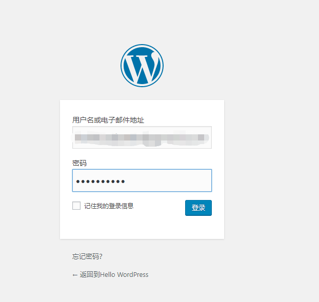

# 使用 Cube 快速搭建 WordPress 网站

## Part 1 创建容器组

1. 进入[Cube 控制台页面](https://console.ucloud.cn/cube/manage)，点击 Cube 的创建按钮进入创建页面，为你的容器组起一个名字，例如 wp_test

2. 选择合适的配置（如 1C1G）后，为容器配置镜像，在 Docker 官方镜像中，选择最新版的 WordPress 镜像，UCloud 镜像仓库 UHub 已经提供了一些常用的 Docker 官方镜像，您也可以将自有镜像推送到 [UCloud 私有镜像仓库](https://docs.ucloud.cn/uhub/guide)

3. 为容器组配置一个外网 IP，对于简单的网站访问，可以先配置 1M，之后可以根据需要升级

4. 点击「立即购买」，完成创建。Cube 在公测期间完全免费，但您需要支付 EIP 等其他产品的费用

5. 创建一个 WordPress 容器组，从创建到 Running 不超过 5 秒钟

## Part 2 配置 MySQL 数据库

1. 在浏览器中键入容器组的外网 IP，可以看到 WordPress 服务已经在容器组里跑起来了，之后，我们还需要进行一些数据库的配置，安装 WordPress

2. 数据库这里，我们可以选择 UCloud 提供的 [MySQL 数据库](https://console.ucloud.cn/udb/sql)，点击创建按钮进入数据库创建页面，选择最简单的 1G 内存 20G 存储空间版本。

3. 配置好数据库名称（这里我设置为 wp-test）和密码（数据库不一定与容器实例在同一可用区），点击「立即购买」创建

4. 在数据库详情页面点击「登录」，进入管理界面，通过用户名（这里我默认为 root）和密码进入

5. 创建一个新的数据库，这里我命名为「wordpress」

## Part 3 配置 WordPress

1. 回到刚刚的 WordPress 配置界面，数据数据库名称（wordpress）、用户名、密码（创建 MySQL 时配置的密码）、服务器地址（数据库 IP 地址:端口号），点击提交，可以看到数据库已经连接成功，可以开始安装了

2. 配置好 WordPress 站点标题，登录 WordPress 的用户名及密码，Let's GO！

3. 安装完成，登录 WordPress 站点，可以看到 WordPress 已经安装成功了

