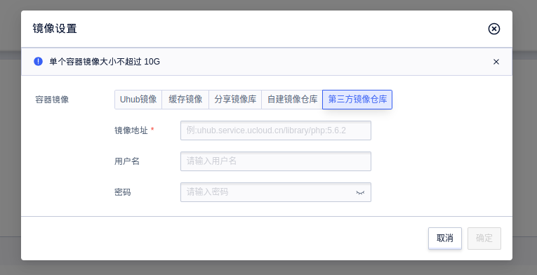

# 第三方镜像仓库支持

Cube支持拉取外部镜像，前提是您的镜像满足如下要求：

- 镜像仓库可以通过外网访问
- 为了安全起见，仅支持HTTPS协议，并且仓库必须有合法的域名
- 镜像支持`linux_amd64`架构

## 控制台创建 / 修改 Cube 实例

您可以在容器的镜像设置页面选择`第三方镜像仓库`以实现拉取外部镜像：



镜像地址必须填写完整，不支持简写，例如`nginx:latest`需要改为`docker.io/library/nginx:latest`。

**受限于带宽影响，外部镜像拉取速度可能会很慢，甚至可能出现失败（特别是DockerHub官方镜像），如果您希望快速拉取镜像，还是建议将镜像缓存到UHub中。**

## API 创建 / 修改 Cube 实例

在通过 API 创建 / 修改 Cube 及 Deployment 时，需要在相应的 pod yaml 文件中 spec 字段下添加 imagePullSecrets 字段，如下：

```yaml
imagePullSecrets:
- registry_type: external  # 必填，表示这是一个外部镜像
  username: 'zth'          # 镜像仓库用户名，非必填
  password: 'Harbor'       # 镜像仓库密码，非必填
```

详细 API 请参照[Cube API 文档](https://docs.ucloud.cn/api/cube-api/index)
