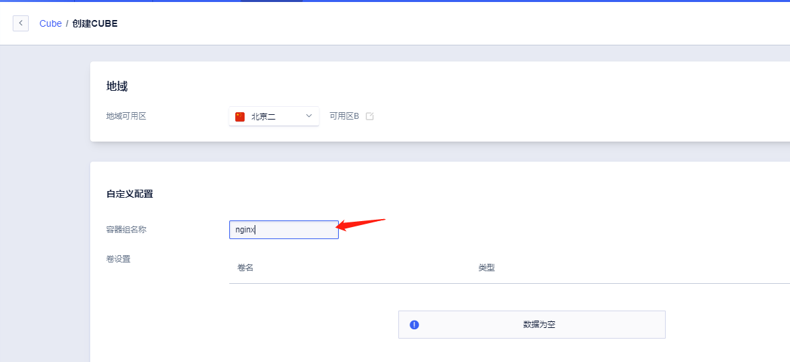
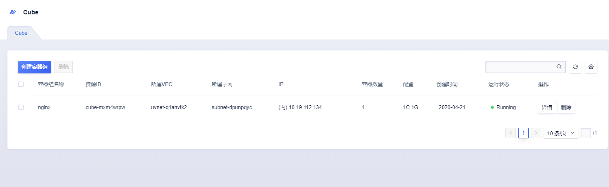

# 快速创建

## 快速创建Cube实例

1. 点击Cube的创建按钮进入创建页面，为你的容器组起一个名字

2. 选择一个仓库内的镜像，这里快速创建我选择的UCloud镜像仓库nginx镜像1.17.10-alpine版本，您可以将自有镜像推送到UCloud私有镜像仓库，[UHub镜像仓库操作](/uhub/guide)

3. 点击确定，完成创建操作，创建一个Nginx容器组,从创建到running约5秒完成。

   
