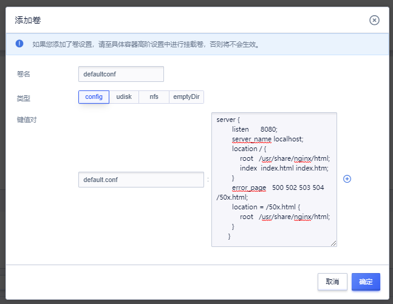

# 在Cube中使用Config

Config提供的是键值对配置文件挂载的功能，与Kubernetes中的configMap资源对象一致。

Config类型的卷设置一般用于应用和配置分离的模式，不同的运行环境对应不同的配置文件。

## 添加卷

进入创建Cube实例的页面，点击卷设置。



在添加卷中输入卷名，选择config类型，支持多对键值对的config文件和多行值的文件挂载到容器内部。


### 以Nginx为例，需要设置监听不同的端口，可以填入如下信息：

卷名：`defaultconf`

键值对key：`default.conf`

键值对value：

```
    server {
        listen      8080; 
        server_name localhost; 
        location / {
            root   /usr/share/nginx/html; 
            index  index.html index.htm; 
        } 
        error_page   500 502 503 504  /50x.html; 
        location = /50x.html { 
            root   /usr/share/nginx/html; 
        }
      }

```

这里可以看到我们修改了nginx的配置文件，将监听端口配置从原80到8080，作为一个配置文件进行创建。

## 挂载卷

点击高阶设置，选择挂载卷。这里可以将我们创建的卷设置进行挂载，我们上面创建了一个nginx的配置文件config，这里我们将它挂进我们的容器中。

挂载卷有3个选项，挂载路径、子路径(subpath)、卷名称。

* 挂载路径，填写文件具体要挂载到某个路径。
* 子路径(subepath)，针对配置来说，挂载时填写子路径，将不会覆盖挂载路径下其他的文件。
* 卷名称，选择已经创建的卷设置。


### 以Nginx为例，挂载config卷，可以填入如下信息：

挂载路径：`/etc/nginx/conf.d/default.conf`

子路径：`default.conf`

卷名称：`defaultconf`

此种填写方法，将不会覆盖`/etc/nginx/conf.d/`路径下的其他文件。

反之，还可以在挂载路径直接填写`/etc/nginx/conf.d/`，不填写子路径，将会覆盖路径下其他文件。