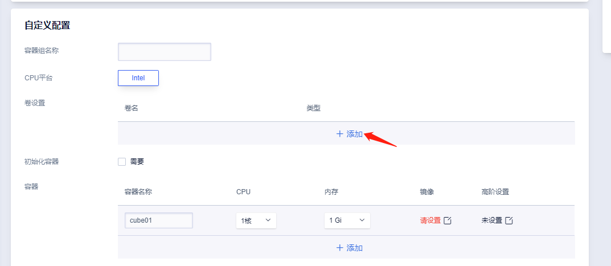
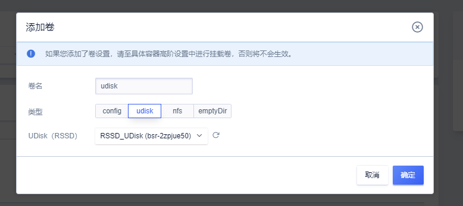
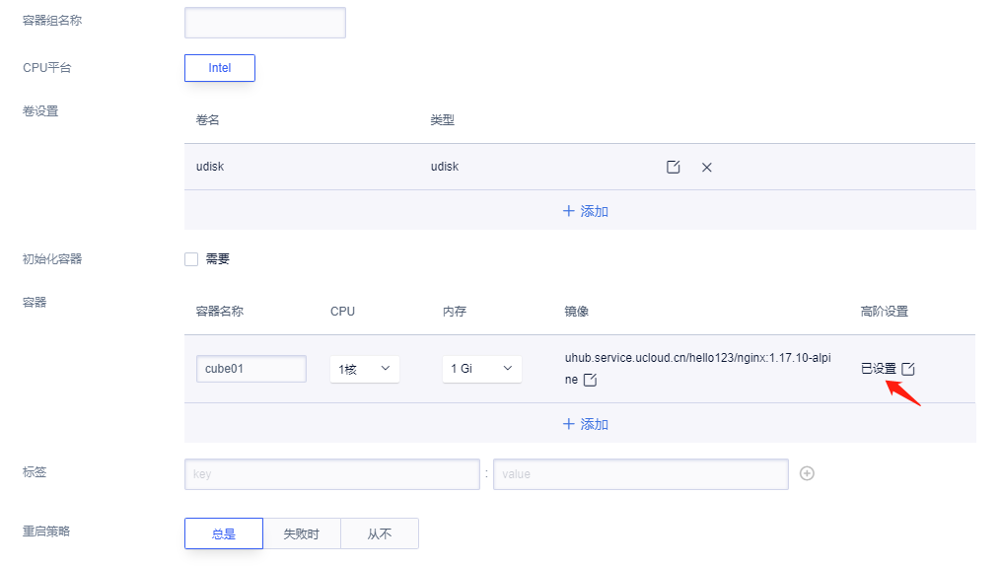
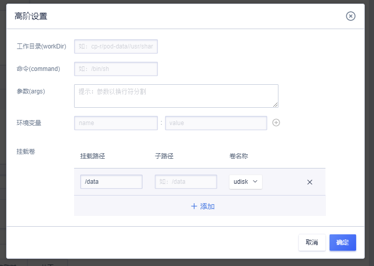
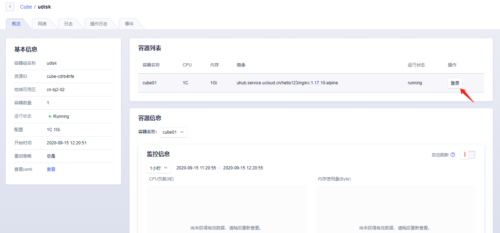
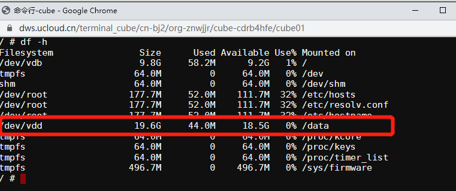

# 在Cube中使用UDisk

目前快杰版Cube只支持RSSD类型的UDisk挂载，具体性能指标请查看[快杰Cube云盘性能](/cube/introduction/kuaijie?id=云盘性能)

## 前置条件

1. 需要在[Cube云盘管理](https://console.ucloud.cn/cube/udisk)购买UDisk云盘。

## 注意事项

1. 块存储仅支持单点挂载，且不支持跨可用区挂载，如需要多点挂载可以选择UFS，
2. 快杰版Cube仅支持RSSD UDisk挂载，
3. 使用克隆功能时，无法克隆UDisk的挂载信息，
4. RSSD UDisk可以在主机页面购买或Cube页面购买，受限于RDMA网络限制，推荐在Cube页面购买。

## 添加卷

已购买好RSSD UDisk云盘后，根据以下流程可以挂载UDisk进行使用。

进入创建Cube实例的页面，点击卷设置。

在添加卷中输入卷名，选择UDisk类型，根据下拉选项选择对应的UDisk云盘并保存。

## 挂载卷

点击容器的高阶设置。

在高阶设置中点击挂载卷，选择我们刚刚添加的卷设置，并输入在容器内需要挂载的路径，这里演示填写为`/data`。

完成以上步骤创建Cube容器实例即可挂载使用UDisk块存储进行数据持久化了。

## 查看挂载是否成功

我们使用Cube概览页面的登录按钮进入容器。

输入`df -h` 查看到我们的块存储已经挂在了容器的`/data`目录下。

