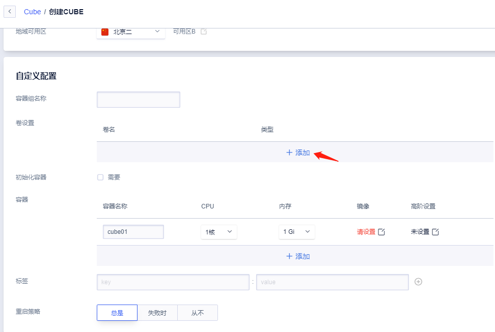
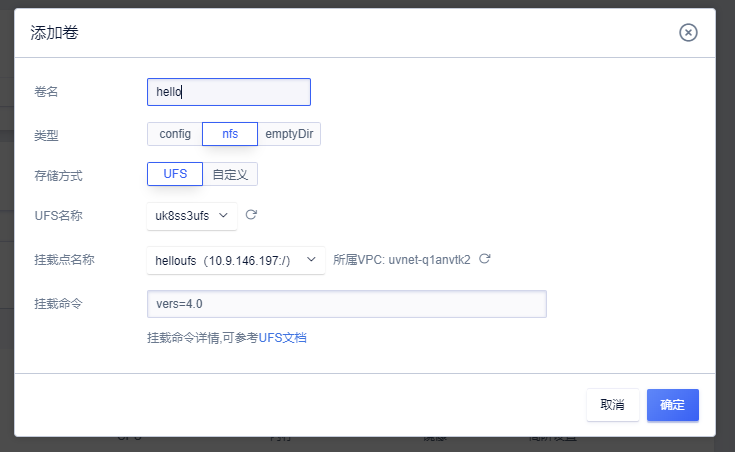
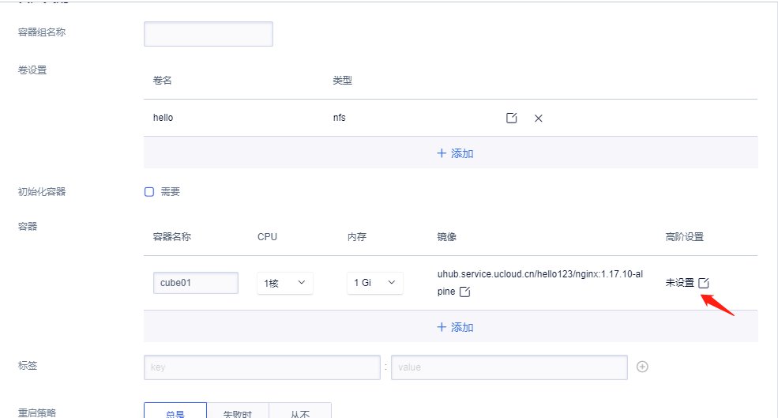
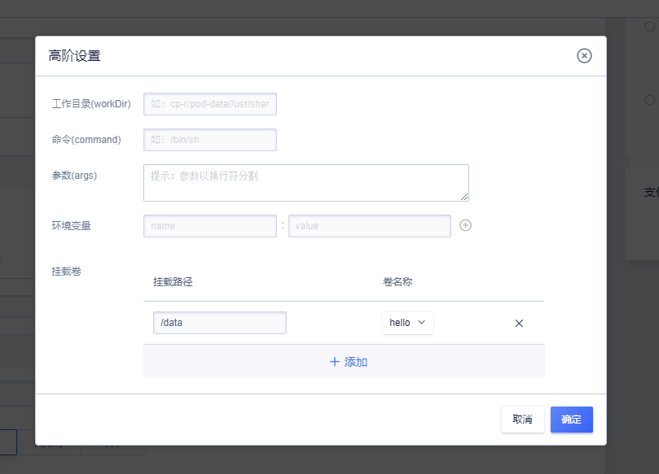
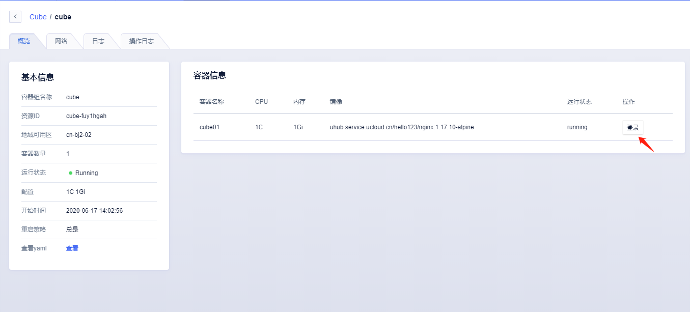
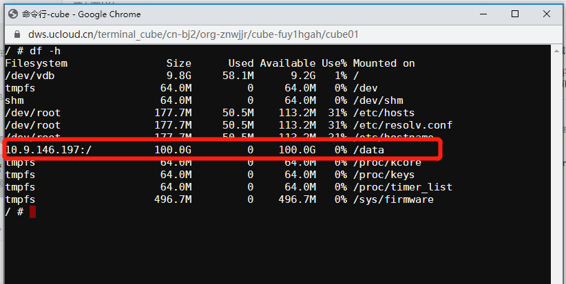

# 在Cube中使用UFS

## 前置条件

需要在[UFS产品页面](https://console.ucloud.cn/ufs/ufs)购买UFS实例并设置好挂载点，如没有创建UFS在使用中请根据提示进行创建。操作后在Cube页面点击刷新即可。

## 添加卷

已经创建好UFS实例和挂载点后，根据以下流程可以挂载UFS进行使用。

进入创建Cube实例的页面，点击卷设置。

在添加卷中输入卷名，选择nfs类型，并选择UFS存储方式，根据下拉选项选择UFS对应的名称和挂载点并保存。

## 挂载卷

点击容器的高阶设置。

在高阶设置中点击挂载卷，选择我们刚刚创添加的卷设置，并输入在容器内需要挂载的路径，这里演示填写为`/data`。

完成以上步骤创建Cube容器实例即可挂载使用UFS文件存储进行数据持久化了。

## 查看挂在是否成功

我们使用Cube概览页面的登录按钮进入容器。

输入`df -h` 查看到我们的文件存储已经挂在了容器的`/data`目录下。

